# <span style="color:#0f6e56">Vita</span><span style="color:#5dcaa5">nova</span> 🌿

> A full-stack e-commerce platform for natural and organic dietary supplements — built with a vanilla PHP/MySQL stack, no frameworks.

---

## 📋 Table of Contents

- [Project Overview](#-project-overview)
- [Features](#-features)
- [Tech Stack](#-tech-stack)
- [Project Structure](#-project-structure)
- [Installation](#-installation)
- [Configuration](#-configuration)
- [Screenshots](#-screenshots)
- [Security](#-security)
- [Author](#-author)

---

## 🌱 Project Overview

**Vitanova** is a complete e-commerce web application developed with a vanilla stack:  
**HTML5 · CSS3 · JavaScript ES6+ · PHP 8 · MySQL 8**

The platform lets customers browse and order bio supplements targeting:

- 😌 Stress & Anxiety
- 😴 Sleep
- ⚡ Energy & Focus
- 🌿 General Wellbeing

It includes a full customer-facing storefront, a user account system, a product review engine, and a protected admin panel — all without any external framework.

---

## ✨ Features

### 🛒 E-Commerce
- Product catalogue with category filters and price sorting
- Persistent cart (localStorage + PHP session)
- Checkout with Tunisian-locale validation (8-digit phone, 4-digit postal code)
- Cash on delivery payment flow
- Order confirmation page with full order summary

### 👤 User Accounts
- Secure registration & login (bcrypt password hashing)
- Personal dashboard: order history and profile info
- Welcome toast notification on login
- Auto-redirect after login/logout

### ⭐ Product Reviews
- Star rating with immediate visual feedback
- One review per product per user enforced server-side
- Average rating displayed on the product detail page

### 🔧 Admin Panel
- Dashboard with key business metrics and analytics
- Full CRUD for products + image upload
- Order status tracking and updates
- User management and contact message inbox

### 🎨 UX & Design
- Light / Dark mode toggle
- Scroll-triggered animations (Intersection Observer API)
- Parallax effect on the hero section
- Toast notifications (success / error)
- Custom illustrated mascots (404, order confirmation, welcome)
- Fully responsive (mobile, tablet, desktop)

### 📧 Contact
- Contact form persisted to the database
- Real-time email sending via **EmailJS** (works on localhost)

---

## 🛠️ Tech Stack

| Layer | Technology |
|-------|------------|
| Frontend | HTML5, CSS3, JavaScript ES6+ |
| Backend | PHP 8 |
| Database | MySQL 8 |
| Email | EmailJS |
| Local Server | XAMPP (Apache) |
| Version Control | Git / GitHub |

---

## 📁 Project Structure

```
Web_ProjectV1/
│
├── index.php               # Homepage
├── boutique.php            # Shop / product listing
├── produit.php             # Product detail page
├── panier.php              # Shopping cart
├── commander.php           # Checkout
├── confirmation.php        # Order confirmation
├── compte.php              # Login / Register / User dashboard
├── contact.php             # Contact page
├── reset_pwd.php           # Password reset
├── 404.php                 # Custom not-found page
│
├── admin/                  # Protected admin panel
│   ├── index.php           # Admin dashboard + analytics
│   ├── produits.php        # Product management (CRUD + image upload)
│   ├── commandes.php       # Order management
│   ├── utilisateurs.php    # User list
│   └── messages.php        # Contact message inbox
│
├── includes/               # Shared PHP modules
│   ├── db.php              # PDO MySQL connection (configure credentials here)
│   ├── auth.php            # Session helpers (isAdmin, requireAdmin, …)
│   ├── functions.php       # Utility functions
│   ├── messages.php        # Centralised error/success messages
│   ├── header.php          # Shared navbar
│   └── footer.php          # Shared footer
│
├── api/                    # Lightweight JSON API endpoints
│   ├── cart.php            # Cart operations
│   ├── order.php           # Order submission
│   ├── contact.php         # Contact form handler
│   ├── reviews.php         # Product reviews
│   └── analytics.php       # Admin analytics data
│
├── assets/
│   ├── css/
│   │   ├── style.css       # Global styles + dark mode
│   │   └── animations.css  # Scroll animations & parallax
│   ├── js/
│   │   ├── main.js         # Navbar, toasts, animations
│   │   ├── cart.js         # Cart logic
│   │   └── validation.js   # Client-side form validation
│   └── img/
│       └── products/       # Uploaded product images
│
├── images/                 # Static site images (logo, hero, etc.)
├── mascots/                # Illustrated SVG/PNG mascot assets
├── videos/                 # Background/promo video assets
│
└── database/
    └── vitanova_db.sql     # Full DB schema + seed data
```

---

## ⚙️ Installation

### Prerequisites
- [XAMPP](https://www.apachefriends.org/) (Apache + MySQL + PHP 8)
- A modern web browser

### Steps

**1. Clone the repository**
```bash
git clone https://github.com/YOUR_USERNAME/vitanova.git
```

**2. Move into the XAMPP web root**
```
C:\xampp\htdocs\vitanova\
```

**3. Start XAMPP**
- Launch **Apache** and **MySQL** from the XAMPP Control Panel.

**4. Set up the database**
- Open [phpMyAdmin](http://localhost/phpmyadmin)
- Create a new database named `vitanova_db` with collation `utf8mb4_unicode_ci`
- Import `database/vitanova_db.sql`

**5. Open the site**
```
http://localhost/vitanova/
```

---

## 🔧 Configuration

Open `includes/db.php` and update the credentials to match your environment:

```php
define('DB_HOST',    'localhost');
define('DB_NAME',    'vitanova_db');
define('DB_USER',    'root');
define('DB_PASS',    '');        // empty by default on XAMPP
```

Also set `ENVIRONMENT` at the top of the same file:

```php
define('ENVIRONMENT', 'development'); // change to 'production' when deploying
```

### Default Admin Account

| Field | Value |
|-------|-------|
| Email | admin@vitanova.fr |
| Password | Vitanova2025! |

> ⚠️ Change the admin password before deploying to production.

---

## 📸 Screenshots

### Homepage 1


### Homepage 2
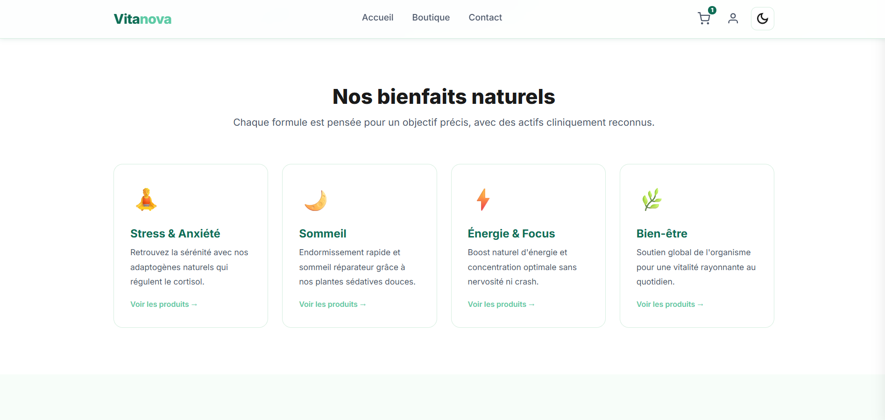

### Homepage 3
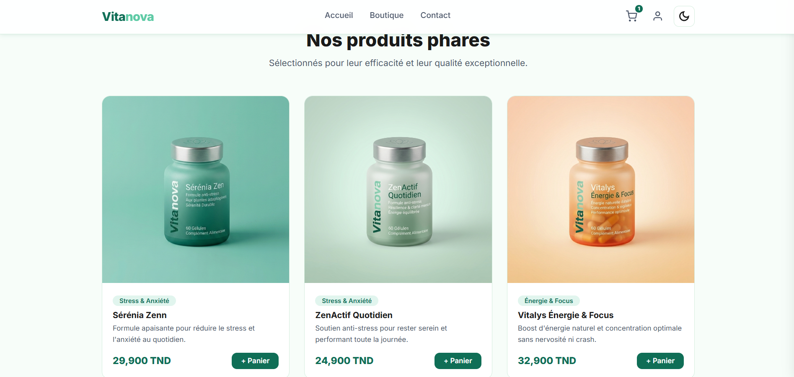

### Shop 1
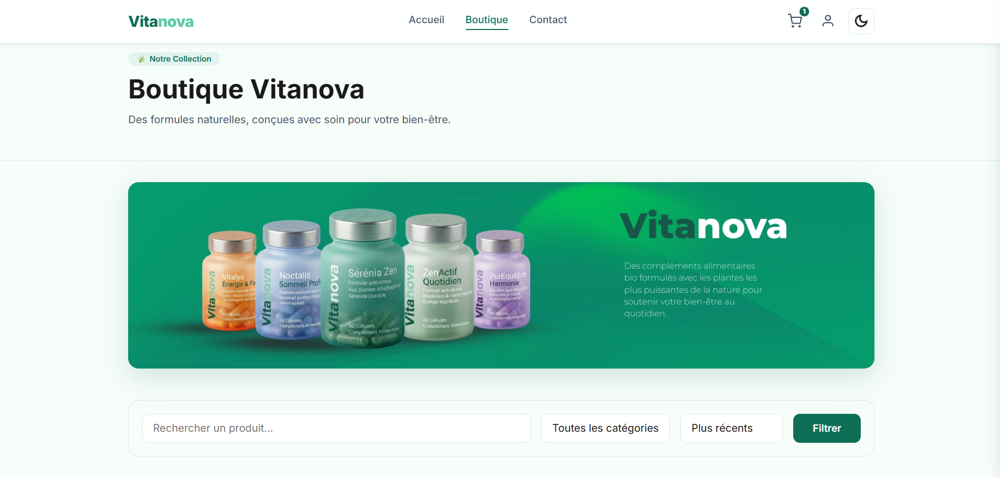

### Shop 2
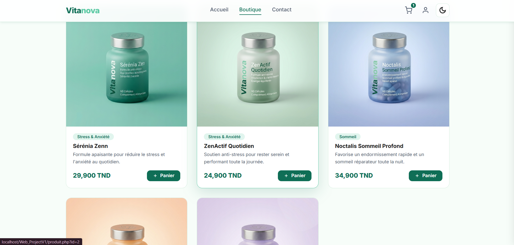

### Product Detail
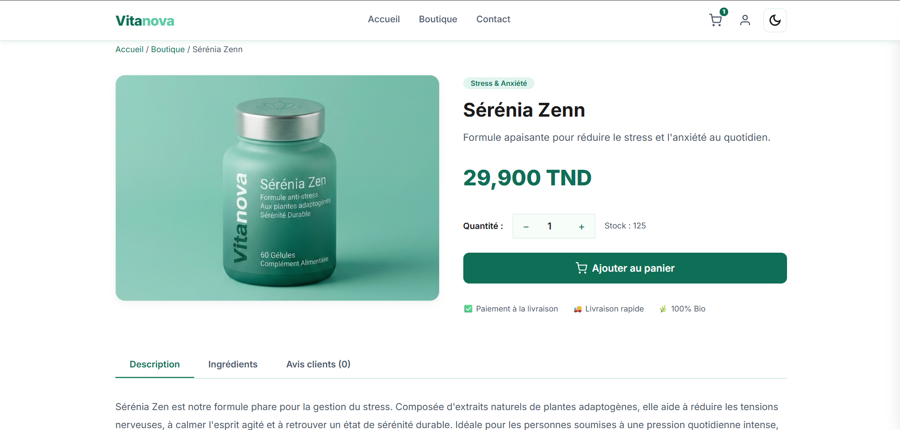

### Shopping Cart
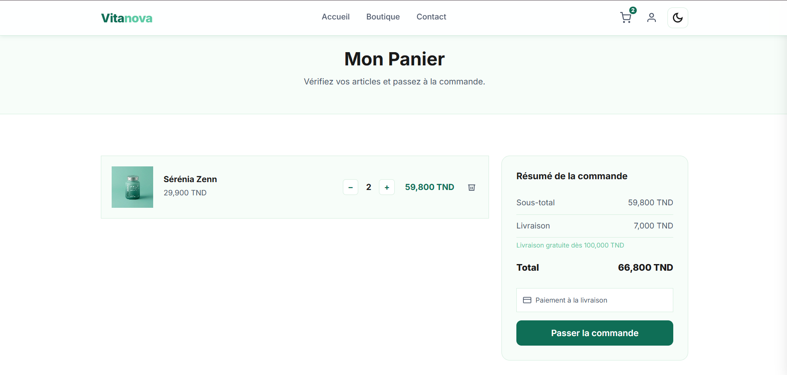

### Checkout
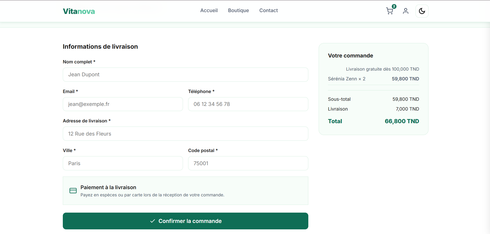

### Order Confirmation
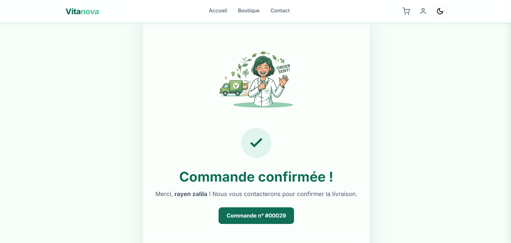

### My Account 
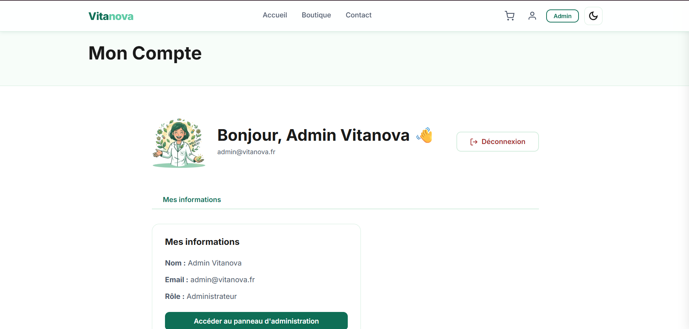

### Admin Panel / Dashboard
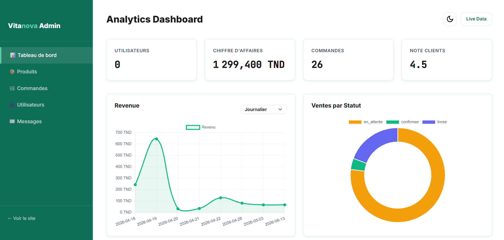

### Contact Page
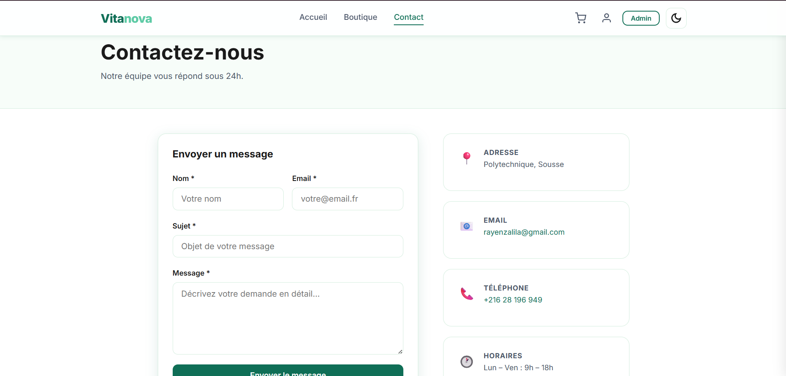

### Dark Mode 1


### Dark Mode 2
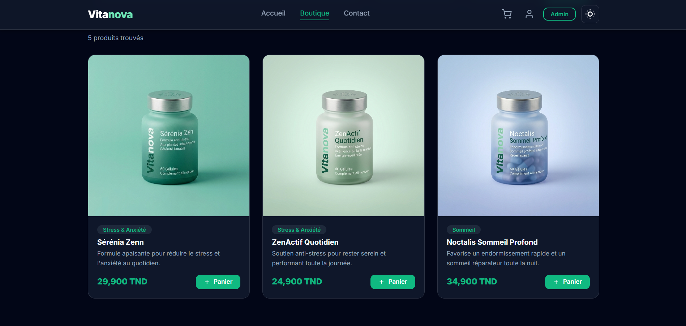

### Dark Mode 3
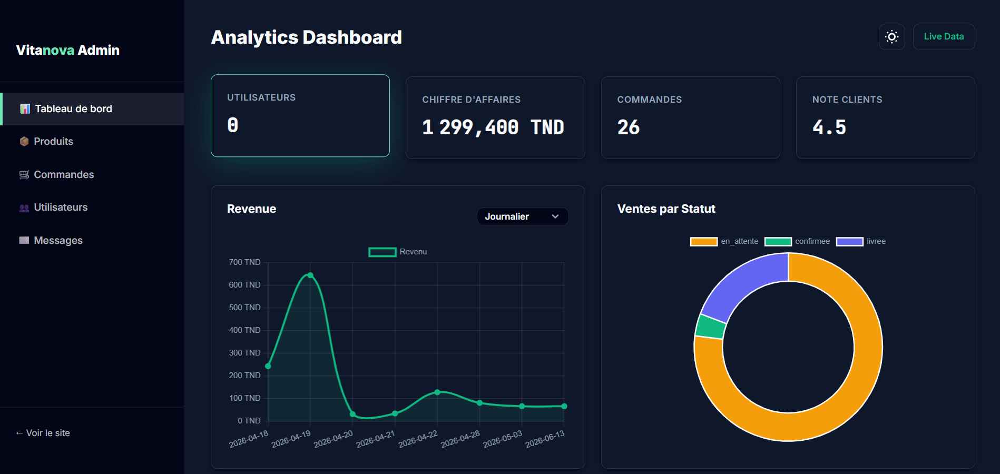

---

## 🔒 Security

- ✅ PDO prepared statements (SQL injection protection)
- ✅ Passwords hashed with `password_hash(PASSWORD_BCRYPT)`
- ✅ CSRF tokens on all forms
- ✅ Session ID regenerated on login (`session_regenerate_id(true)`)
- ✅ Two-layer validation: JavaScript (client) + PHP (server)
- ✅ Admin routes protected by role check (`requireAdmin()`)
- ✅ Centralised error messages via `includes/messages.php`

---

## 👤 Author

**Rayen Zalila**  
Software Engineering Student — École Polytechnique de Sousse  
📧 rayenzalila@gmail.com

---

<p align="center">
  <b>Vita</b>nova &copy; 2026 — All rights reserved
</p>